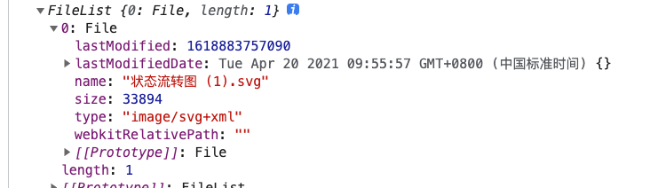

## ArrayBuffer

ArrayBuffer 用于表示通用的、长度固定的二进制数据缓冲区。简单的说就是 ArrayBuffer 表示了一个块内存，通过 ArrayBuffer 可以操作这块内存中的二进制数据。

```js
// 开辟了一块大小为16个字节的内存
const buf = new ArrayBuffer(16)
console.log(buf.byteLength) // 16
```

ArrayBuffer 属性和方法

- 属性 length: ArrayBuffer 构造函数的 length 属性，其值为 1。
- 方法 isView(arg): 判断是否为视图实例，参数为 TypedArray 和 DataView 的实例时，会返回 true。（TypedArray 和 DataView 用于操作 ArrayBuffer）
- 方法 transfer(buffer, [, length]): 返回新的 ArrayBuffer 对象，内容取自 buffer 中的数据，数据会根据 length 的大小进行截取或补 0。

实例属性和方法：

- 方法 slice(begin[, end]): 根据 begin 和 end 返回新的 ArrayBuffer。

- byteLength ： 返回 ArrayBuffer， 单位为 byte

- buffer： 被描述的 ArrayBuffer 实例

- byteOffset: 描述的 ArrayBuffer 的偏移量

可以看到 ArrayBuffer 的属性和方法比较少，并且都没有读写的 API，那我们要怎么去操作 ArrayBuffer 呢？ 其实 ArrayBuffer 是不能直接操作，需要通过视图才能够操作。

## 视图

### DataView

DataView 视图是用与操作 ArrayBuffer 对象的接口

#### 语法：

```js
new DataView(buffer [, byteOffset [, byteLength]])
// buffer：ArrayBuffer实例
// byteOffset: 视图对象在buffer中的偏移量，默认第一个开始
// byteLength: 视图的长度

// 视图可以只描述buffer实例其中一部分数据，
```

#### 简单使用：

```js
const buf = new ArrayBuffer(16)
const view = new DataView(buf)
view.setInt16(0, 231) // 从ArrayBuffer的第一个字节开始写入一个16位（2个字节）的int数据，值为231
view.getInt16(0) // => 231  在ArrayBuffer中从第一个字节开始按16位的int类型读取数据
```

注意点：设置数据和读取数据时，可以自定义字节序，默认为大端字节序。

```js
const buf = new ArrayBuffer(16)
const view = new DataView(buf)
// 将304按小端字节序存储，
// 304的二进制是 00000001 00110000
// 小端存储的结果是 00110000 00000001
view.setInt16(0, 304, true)
// 按小端读取: 431
view.getInt16(0, true)
// 按大端读取值为12289
view.getInt16(0) // 12289
```

DataView 不仅有 Int16 的 API，还有许多可以在 [MDN 查询](https://developer.mozilla.org/zh-CN/docs/Web/JavaScript/Reference/Global_Objects/DataView)

### TypedArray（定型数组）

TypedArray 也是用于操作 ArrayBuffer。不过并没有 TypedArray 的全局属性。一般所说的 TypedArray 是指它的实例：Int8Array、Uint8Array、Uint8ClampedArray、Int16Array、Uint16Array、Int32Array、Uint32Array、Float32Array、Float64Array

#### 语法：

```js
// 1. 传入length, 会自动创建对应长度的ArrayBuffer，Int16是两个字节，长度为2，因此这里创建的ArrayBuffer长度为4个字节
const int16 = new Int16Array(2)
int16.buffer.byteLength // 4

// 2. 传入ArrayBuffer
const buf = new ArrayBuffer(4)
const int16 = new Int16Array(buf) // new TypedArray(buffer [, byteOffset [, length]]);
int16.length // 2

// 3. 传入TypedArray会复制一个新的TypedArray，新的长度不会变，每个值在被复制到新的数组之前，会被转化为相应类型的构造函数
const int32 = new Int32Array(2)
const int16 = new Int16Array(int32)
int16.length // 2

// 4. 传入数组，会把数据当成数据自动创建ArrayBuffer，
const int32 = new Int32Array([21, 31])
int32.length // 2
int32.buffer.byteLength // 8 ，数据长度为2，一条数据占32位（4个字节）因此长度就是2*8
int32[1] // 31

// 5. 通过from方法
const int32 = Int32Array.from([21, 31])

// 6. 通过of方法，和from的区别在与参数不同
const int32 = Int32Array.of(21, 31)
```

TypedArray 的使用非常类似数组，可以通过下标取值赋值，能使用的方法和属性也类似（length、every、forEach 等等），具体可以在[MDN 上查询](https://developer.mozilla.org/zh-CN/docs/Web/JavaScript/Reference/Global_Objects/TypedArray), ArrayBuffer 是不支持动态调整大小的，会修改数组大小的方法都不能使用：push、concat、pop、shift、splice、unshift。

set 方法: 把提供过的数组或定型数组复制到指定的位置

```js
const int32 = new Int32Array(8)

int32.set([1, 2, 3], 0)
int32.set(Int32Array.of(4, 5), 3)
int32 // Int32Array(8) [1, 2, 3, 4, 5, 0, 0, 0]
```

subarray 方法：从定型数组中复制出一个新的定型数组

```js
const int32 = new Int32Array([1, 2, 3, 4, 5])
const copyInt32 = int32.subarray(1, 3) // subarray([begin [, end]])
copyInt32 // Int32Array(2) [2, 3]
```

## Blob(Binary Large Object)

Blob 表示二进制类型的大对象,例如图片、音频、视频、文件。ArrayBuffer 也可以表示二进制数据，Blob 不同的是 Blob 是不可变的，不能修改 Bolb 中的二进制数据。 

#### 语法

```js
// blobParts 由 ArrayBuffer，ArrayBufferView，Blob，DOMString 等对象构成的数组。DOMStrings 会被编码为 UTF-8。
// options.type MIME类型
// options.endings 指定包含行结束符  `\n`  的字符串如何被写入，可能的值有native和transparent， 默认为transparent
// native: 行结束符会被更改为适合宿主操作系统文件系统的换行符
// transparent: 保持 blob 中保存的结束符不变
const myblog = new Blob(blobParts[, options])
```

#### 属性

- size blob 的数据大小，单位为 byte
- type 返回 blob 的 MIME 类型

#### 方法

- slice( [ start [, end [, contentType ] ] ] ) 返回包指定范围内的数据的新的 blob 对象，用这个方法可以实现文件的分片上传，将文件分成多个块并标记顺序，然后分步把每个块上传，然后服务端接受完所有块之后，按照执行的顺序将所以块合并为一个文件。
- stream() 返回读取 blob 内容的 [ReadableStream](https://developer.mozilla.org/zh-CN/docs/Web/API/ReadableStream)
- text() 返回一个 promise 且包含 blob 所有内容的 UTF-8 格式的 [`USVString`](https://developer.mozilla.org/zh-CN/docs/Web/API/USVString)
- arrayBuffer() 返回一个 promise 且包含 blob 所有内容的二进制格式的 [`ArrayBuffer`](https://developer.mozilla.org/zh-CN/docs/Web/JavaScript/Reference/Global_Objects/ArrayBuffer)

## File

File 继承于 Blob，它是一中特殊的 Blob，File 会通常是用户用过 input 上传后的文件，它会包括一些文件相关的信息，比如文件的最后修改时间，文件的名称等，而 Blob 是通用的二进制对象，没有包含这些与文件系统有关的信息。和 blob 一样，也可以通过`new File()`来创建一个文件对象。 

#### File 除了继承于 Blob 的属性与方法

- lastModified 文件的最后修改时间戳
- lastModifiedDate 文件最后修改时间的 Date 对象
- name 文件的名字
- webkitRelativePath File 相关的 path 或 URL，当上传的是一个文件夹时，这个字段表示该文件相对于文件夹的路径

## FileReader

> `FileReader` 对象允许 Web 应用程序异步读取存储在用户计算机上的文件（或原始数据缓冲区）的内容，使用 [`File`](https://developer.mozilla.org/zh-CN/docs/Web/API/File) 或 [`Blob`](https://developer.mozilla.org/zh-CN/docs/Web/API/Blob) 对象指定要读取的文件或数据。（引自 MDN）

`FileReader`用于读取 Blob 或 File 类型的二进制数据，调用它不同的方法，会返回不同的数据类型。

读取数据的方法有：

- `readAsText(blob, [encoding])` 返回结果为字符串
- readAsDataURL(blob) 返回编码为 base64 的 data url
- readAsArrayBuffer(blob) 返回二进制格式的 ArrayBuffer

### 使用

```html
<input type="file" onchange="readFile(this)" />
<script type="text/javascript">
  function readFile(input) {
    let file = input.files[0]
    let reader = new FileReader()
    reader.onload = function () {
      console.log(reader.result)
    }
    reader.onerror = function () {
      console.log(reader.error)
    }
    reader.readAsText(file)
  }
</script>
```

新建 FileReader 实例后，可以用过实例的`read`系列的方法来读取数据，读取过程中，我们可以用`on`或`addEventListener`的方式监听到过程中的各个事件，读取完毕之后会触发`onload`事件，并把读取的结果放在实例的`result`属性上；读取异常会触发`onerror`事件，错误信息可以在属性`error`上获取到。读取文件的状态在属性`readyState`上

#### 读取过程中的事件

- `loadstart` : 开始加载。
- `progress` : 在读取过程中出现。
- `load` : 读取完成，没有 error。
- `abort` : 调用了 `abort()` 。
- `error` :出现 error。
- `loadend` : 读取完成，无论成功还是失败。

FileReader 还提供了一个`abort()`方法，可以中断读取，中断后会触发`abort`事件,

#### 构造函数属性

- FileReader.EMPTY 状态常量，值为 0，表示还没有加载任何数据
- FileReader.LOADING 状态常量，值为 1，表示数据正在被加载
- FileReader.DONE 状态常量，值为 2，表示已完成全部的读取请求

## URL.createObjectURL

这里单独介绍一下`URL.createObjectURL`方法，

```js
// file 是用户通过input上传的一个图片
const url = URL.createObjectURL(file)
cosnt img = document.getElementById('img')
img.src = url
```

传入一个 file 或 blob 对象，会返回一个 url 地址，这个地址可以读取到传入的内容。可以用来做本地图片上传后服务器之前的预览。这个 url 和文档的生命周期是一致的，文档销毁了，url 也会生效。还可以通过`URL.revokeObjectURL`方法来主动释放该 url。

## TODO

- 下节再补充 API 的应用场景
- 边学习边记录，会有些不足之处，立个`flag`，下次一定回来再重新看看，再更新一版
