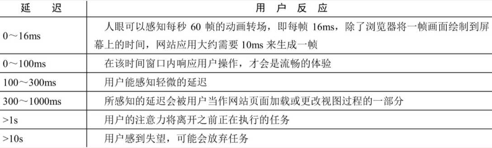
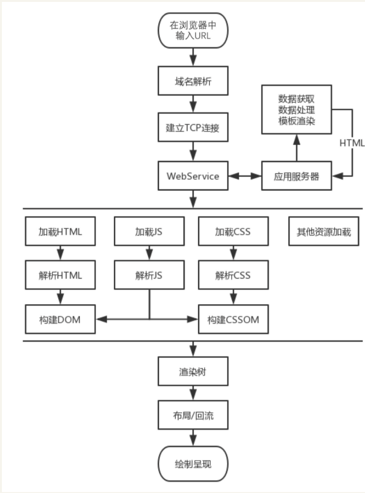

## 性能

在同类产品中，在性能上更优秀的产品，产品的价值也会更高。

### 一、性能的影响：

1. 用户的留存。留存用户是自某次使用后，经过一段时间后，仍然还在使用的用户。疫情中产品有关注次日留存率（次日再次访问疫情的用户比率）。google 营销平台调研发现网站加载时长超过 3s，53%的移动端网站访问遭到用户抛弃。
1. 网站的转化率。用户在网站上进行某一个目标行为次数和总访问量的比率。可以是用户注册、资源下载、购买、链接跳转等。
1. 体验与传播。移动端访问时，网页资源文件过大、组织冗余，用户会浪费过多的流量费用，过大的资源也会影响请求耗时，最终降低用户体验。用户体验差后，也会造成用户不会向自己的周边推荐该网站，甚至用户对网站进行差评，带来差的口碑

### 二、性能评估模型

RAIL 模型：

- R: Response 响应
- A: Animation 动画
- I: Idle 空闲
- L: Load 加载

用户感知的时间窗口： 

#### 2.1 Reponse

网站性能对响应的要求：用户在感知延迟之前能接受到操作的反馈，例：点击、输入、切换、开启动画等，需要在 100ms 内让用户接受到反馈，超过 100ms，用户会感知大延迟。

用户操作后，当处理操作需要数百毫秒才能完成，可以及时的为用户提供阶段性反馈。如： 提示用户开始处理、显示处理进度、完成反馈提示。

#### 2.2 Animation

人眼有视觉暂留特性，当眼镜接受到光产生视觉后，视觉效果能保留一段时间。研究表明这是视觉神经的反应速度曹成的，时间为 1/24 秒，约 42 毫秒。对于动画，无论动画帧率多高，我们仅能分辨其中的 30 帧，不过帧率越高，用户的体验会更流畅。动画要尽力大刀 60fps。

60fps 帧率的动画，一帧图的生成时间为 16ms。除去浏览器绘制时间，代码执行时间大概在 10ms 左右，

#### 2.3 Deal

并非所有工作都需要在响应和加载阶段来完成，可以利用浏览器的空闲时间来处理可以延迟执行的任务。为更好的利用浏览器的空闲时间，可以将任务以 50ms 为单位进行分组，保证用在 100ms 内能够接受到响应

#### 2.4 Load

根据用户感知，页面需要在 1s 内加载完成。超过 1s 用户的注意力将离开当前的任务，从用户感知角度，关键渲染路径完成，用户就会认为全部加载完成，非关键资源可以在浏览器空闲时段再执行。

### 三、性能优化步骤

1. 可量化的评估出网站的性能表现
   1. chrome preformance
   2. Lighthouse
   3. 打点统计
2. 基于网站的生命周期，分析出造成性能差的原因
   1. 
3. 优化改造
   1. 资源传输、
   2. 加载过程优化、延迟加载，非首屏信息，延时加载
   3. 代码层优化
   4. 关键渲染路径优化，不必要的重绘和回流
   5. 缓存技术
